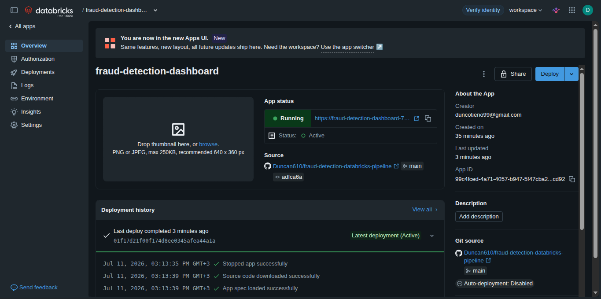
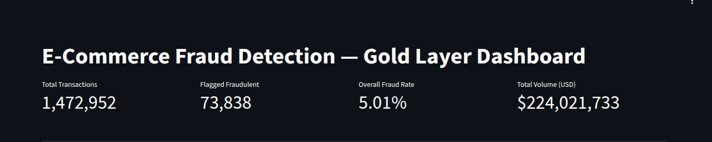
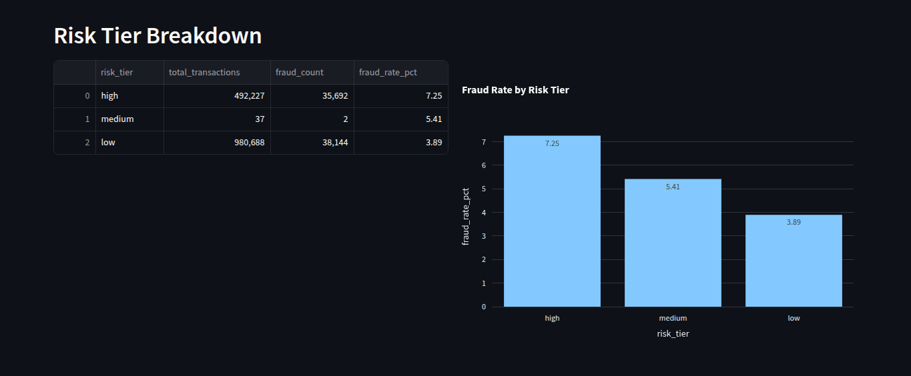
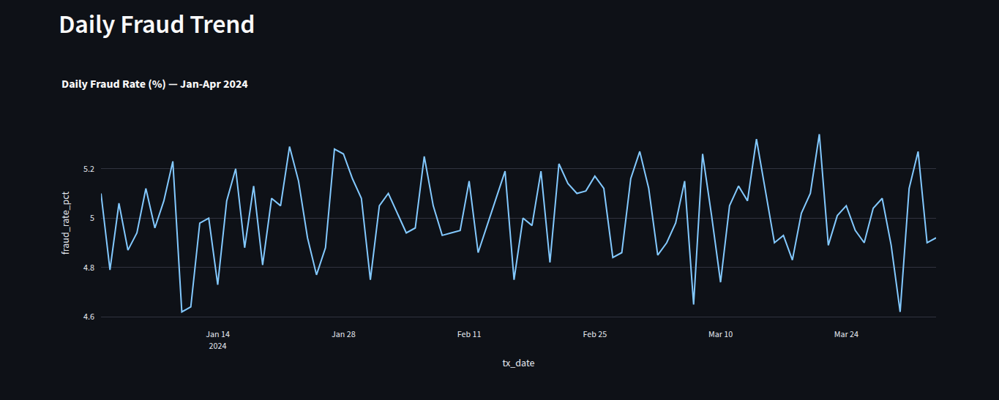
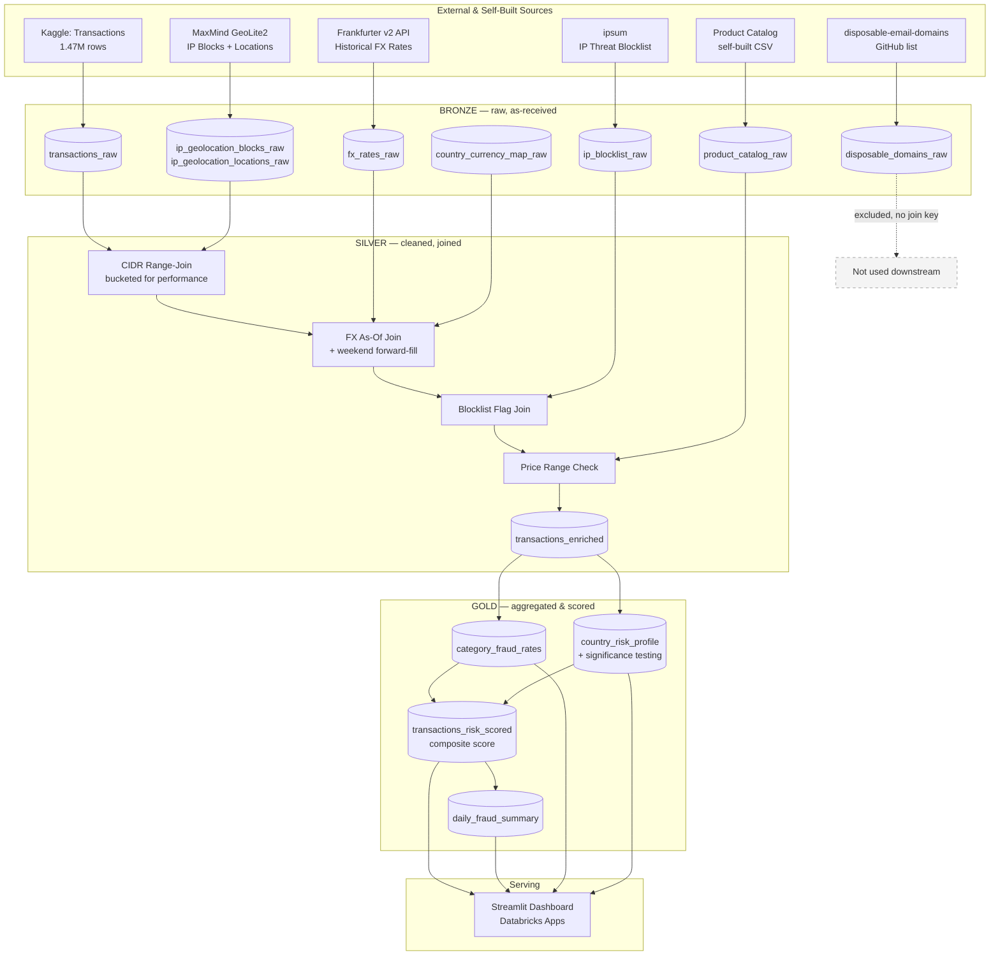
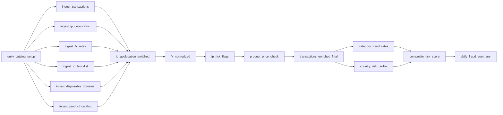
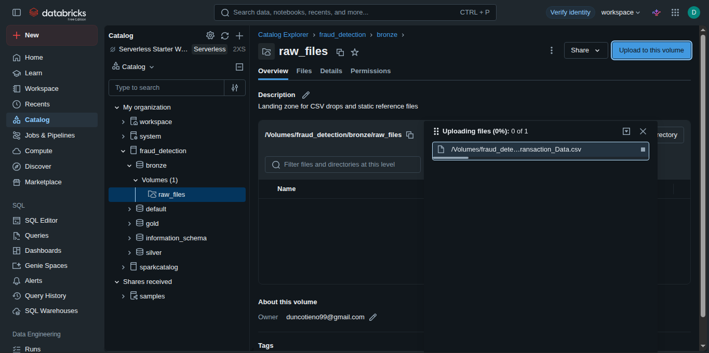
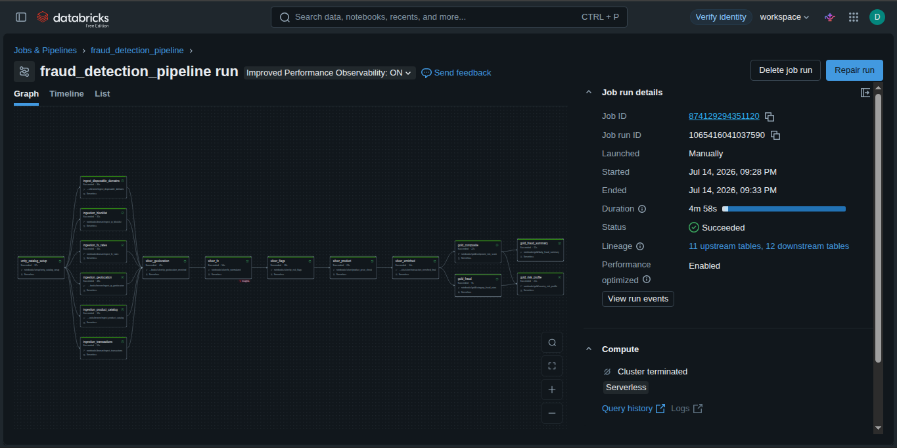
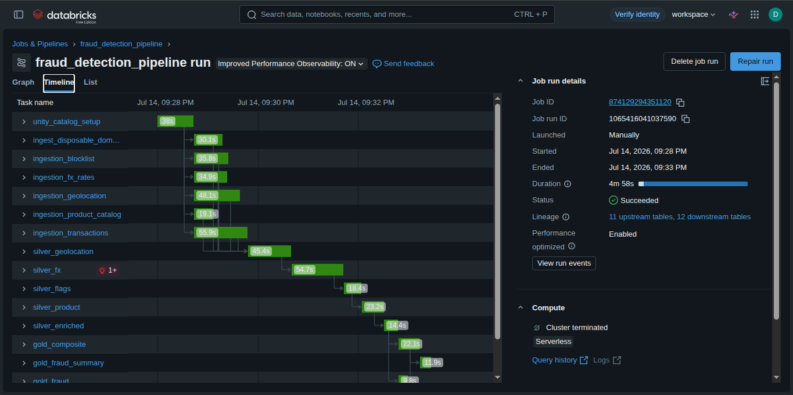
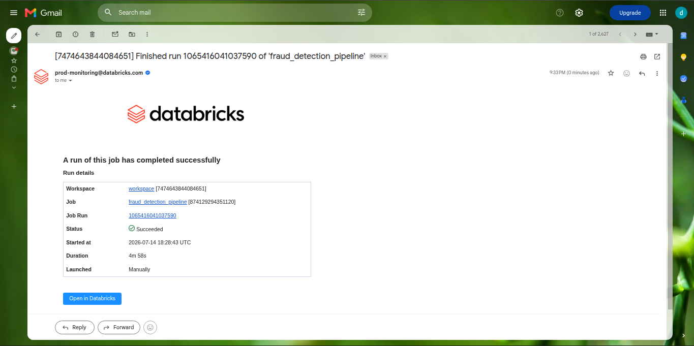

# Fraud Detection Pipeline

**A batch-oriented, six-source data engineering pipeline that ingests, enriches, and scores e-commerce transactions for fraud risk — built end-to-end on Databricks with Unity Catalog, Delta Lake, and Databricks Apps.**

[Live Dashboard](https://fraud-detection-dashboard-7474643844084651.aws.databricksapps.com/) · [Architecture](#architecture) · [Engineering Decisions](#engineering-decisions--what-actually-happened) · [Key Findings](#key-findings-what-the-data-actually-shows)

---

## The Story

Every e-commerce platform faces the same quiet, expensive problem: some fraction of transactions aren't real purchases  they're stolen cards, compromised accounts, or bad actors testing what they can get away with. No single field in a transaction table tells you which is which. Fraud teams don't look at amount alone; they triangulate — where did this connection actually come from, does that match what the customer claims, has this IP misbehaved before, does the price even make sense for what was bought.

That triangulation is fundamentally a **data engineering problem** before it's ever a modeling problem: you need clean ingestion from sources that don't agree with each other, joins that don't have obvious keys, reference data that goes stale, and a pipeline that's honest about what it can and can't prove. This project builds that pipeline from scratch, using a real (synthetic) transaction dataset and five independent, real-world reference sources.

## The Solution

A **six-source, medallion-architecture batch pipeline** on Databricks:

- **Bronze** — six sources landed exactly as received, no business logic
- **Silver** — cleaned, joined, and conformed: IP-to-country resolution via a CIDR range-join, currency normalization via a historical as-of join, threat-intelligence flagging, and price-sanity checks
- **Gold** — aggregated, statistically validated fraud signals, a composite risk score, and a time-series summary
- **Dashboard** — a live Streamlit app (deployed via Databricks Apps) reading directly from gold
- **Orchestration** — a Databricks Workflows job (DAG) chaining all of the above, Git-sourced, with failure notifications

What makes this project different from a typical portfolio pipeline isn't that everything worked it's that **several things didn't**, and the process of catching, diagnosing, and fixing those failures is documented in full below, because that process *is* the actual skill being demonstrated.

## Dashboard

Live app: **[fraud-detection-dashboard](https://fraud-detection-dashboard-7474643844084651.aws.databricksapps.com/)**

Built with Streamlit, deployed via Databricks Apps, querying the gold layer directly through a Databricks SQL Warehouse connection with a least-privilege service-principal grant.

### App Status


### Summary Metrics


### Risk Tier Breakdown


### Daily Fraud Trend


---

## Scope & Limitations

This project's "fraud detection" currently rests on **one validated signal** `price_out_of_range` (7.25% fraud rate vs. 3.89% baseline) not a trained classifier. The gold-layer `composite_risk_score` is a transparent, fixed-weight heuristic built around that single feature, plus lower-weighted features included for real-world completeness rather than proven predictive value.

Every other reference signal tested showed no meaningful correlation with the fraud label **in this dataset**:
- IP blocklist match: 0% fraud overlap across 52 matches
- Product category: 4.95%–5.05%, statistically uniform
- IP-derived country: no signal after correcting for testing 238 groups at once

This is documented in full in [Engineering Decisions](#engineering-decisions--what-actually-happened) surfaced here upfront rather than left until deep in that section, since it materially affects how the "fraud detection" claim should be read. A trained model (logistic regression / gradient boosting) evaluated against this heuristic, an automated test suite, and a sample-data reproduction path are in progress see [Future Improvements](#future-improvements).

---

## Architecture



Orchestrated end-to-end as a single Databricks Workflows job (DAG shown below), Git-sourced from this repository, running on Serverless compute.



---

## Tech Stack

| Layer | Technology |
|---|---|
| Compute & storage | Databricks (Serverless SQL Warehouse + Notebooks), Delta Lake |
| Governance | Unity Catalog (catalog/schema/volume structure, service-principal grants) |
| Orchestration | Databricks Workflows (Git-sourced DAG, email notifications on failure) |
| Language | PySpark, SQL, Python |
| Serving | Streamlit, deployed via Databricks Apps |
| Version control | Git / GitHub |

---

## Data Sources

| # | Source | Type | Rows | Role |
|---|---|---|---|---|
| 1 | [Kaggle: Fraudulent E-Commerce Transactions](https://www.kaggle.com/datasets/shriyashjagtap/fraudulent-e-commerce-transactions) | CSV | 1,472,952 | Core fact table |
| 2 | MaxMind GeoLite2 (Blocks + Locations) | CSV, 2 files | 3,755,595 + 80,245 | IP → real-world country/city resolution |
| 3 | [Frankfurter v2 API](https://frankfurter.dev/) | REST, historical range | 13,244 | Daily FX rates, 165 currencies |
| 4 | [stamparm/ipsum](https://github.com/stamparm/ipsum) | GitHub, daily-updated | 113,825 | IP threat/blocklist confidence score |
| 5 | [disposable-email-domains](https://github.com/disposable-email-domains/disposable-email-domains) | GitHub | 7,892 | Evaluated, **not used** — see below |
| 6 | Product Catalog | Self-built CSV | 20 | Category price-range reference |
| — | [thiagodp/country-to-currency](https://github.com/thiagodp/country-to-currency) | GitHub | 251 | ISO country → currency mapping |


**On source #5:** the disposable-domains list was researched, vetted for active maintenance, and ingested into bronze but the transaction dataset has no customer email field to join it against. Rather than fabricate a synthetic email field (compounding one layer of synthetic data on another), it was deliberately excluded from silver/gold. In a system with real customer emails, this would be a straightforward join. Documented here as an evaluated, intentional exclusion rather than an oversight.

### Ingestion in practice


The core transaction dataset (1,472,952 rows) landed in the `fraud_detection.bronze.raw_files` Unity Catalog volume before being read into Delta.

---

## Engineering Decisions — What Actually Happened

This section is the core of the project. Each of these was a real failure, caught and fixed, not a hypothetical "lesson learned."

### Bronze layer

**Multi-line CSV fields silently corrupted columns.** The transaction CSV's address fields contain embedded newlines inside quoted values. Spark's default parser doesn't look inside quotes for line breaks, so it treated each embedded newline as a new row — shifting every column after the address fields and turning `is_fraudulent`, `account_age_days`, and `transaction_hour` into silent `null`s. Fixed with `multiLine=True, escape='"'`. Trade-off: this disables a Spark parallelism optimization on large files, a real correctness-vs-performance decision.

**Delta Lake rejected the source's column names.** Spaces in headers like `"Transaction ID"` fail Delta's naming rules. Renamed to `snake_case` at ingestion rather than enabling Delta's Column Mapping feature — simpler for a net-new table, no need for a non-default feature.

**The original IP-geolocation plan was infeasible at scale.** Planned to enrich IPs via a live API (`ip-api.com`). Before writing that code, checked the actual unique-IP count: **1,472,651 of 1,472,952 transactions have a unique IP.** At the API's 45-requests/minute free tier, full enrichment would take ~23 days. Pivoted to MaxMind GeoLite2 — a downloadable reference dataset, joined locally, zero rate-limit risk — which is also closer to how real fraud platforms handle this volume.

**A schema-inference bug silently corrupted the product catalog's price ranges.** `typical_max_price` was inferred as a `string` column (a formatting quirk in one value broke inference for the whole column). Aggregating with `MAX()` then compared values **alphabetically**, so `"40.00"` beat `"250.00"` — every category's true max price was wrong. Fixed with explicit `.cast("double")`. This is the second inference-related bug in the project; the project now favors explicit schemas for small hand-authored files.

### Silver layer

**A naive range-join was on track to take hours.** Matching each transaction IP into a MaxMind CIDR block isn't an equality join — it's a "falls between" condition. The first attempt (`broadcast()` + a range condition) forced Spark into a **Broadcast Nested Loop Join**: roughly 1.47M × 3.75M ≈ **5.5 trillion comparisons**, still running after 20+ minutes with no end in sight. Fixed by bucketing both sides on a `/16`-equivalent integer range *before* the join, converting it into a fast equality-based broadcast join with the range check only applied within matching buckets. Bucket count grew by only 0.3% (3,755,595 → 3,767,792), confirming only a handful of oversized blocks span multiple buckets. Final join verified exact: 1,472,952 in, 1,472,952 out.

**A core assumption about the data turned out to be false.** The plan was to compare IP-derived country against the transaction's `customer_location` field to flag mismatches. On inspection, `customer_location` values (`"East Timothy"`, `"Amandaborough"`) are synthetic placeholder text, not real geography — this comparison was never valid. Redesigned the signal to use IP-derived country as a standalone feature instead of a fabricated mismatch flag.

**Currency assignment needed a real anchor, and the join needed exact keys.** With no currency field and a fake location field, currency was instead assigned from the **real, IP-derived `country_iso_code`** — joined via ISO code (not country name text, which breaks on cases like `Türkiye` vs. `Turkey`). ~0.9% of transactions (13,377) had no resolvable IP/country at all (anonymous proxies, unallocated ranges); these were defaulted to USD with an explicit `currency_is_defaulted` flag rather than silently blending them in.

**The first FX data source only covered ~30 currencies — a real 16.6% data gap.** Using Frankfurter's v1 (ECB-only) endpoint left 74.9% of (date, currency) pairs unresolved, and critically, this wasn't a long tail of obscure currencies — it included active national currencies like RUB, TWD, EGP, ARS, COP, and VND. Switched to Frankfurter's **v2** endpoint (84 central banks blended, ~200 currencies), reducing the gap to 1.1% of pairs (2 currencies: XCG and ZWG, both extremely recently introduced) — a ~0.01% transaction impact, defaulted with a flag.

**A currency conversion bug produced a $231,000 "transaction."** The first implementation multiplied `transaction_amount` by `rate_to_usd`. Since `rate_to_usd` is local-currency-units-per-USD, this is backwards — the correct operation is division. Caught by sanity-checking output values rather than trusting code that ran without error.

**Two features were validated — and one wasn't, honestly reported both ways.** IP blocklist matches were extremely rare (52 of 1,472,952 transactions) with **0% fraud overlap**, versus a ~5% baseline — an expected mismatch between a live 2026 threat feed and a synthetic label with no real relationship to it, documented as such rather than discarded or oversold. Product price-range mismatch, by contrast, showed a real, meaningful gap: **7.25% fraud rate for out-of-range transactions vs. 3.89% for in-range** — the strongest validated signal in the project.

### Gold layer

**Category and country were tested for real signal, not just reported.** Category-level fraud rates came back nearly uniform (4.95%–5.05% across all five categories) — no real signal. Country-level rates showed a wider apparent spread (1.67%–9.09%), but testing 238 countries at once means **~12 would cross a 95%-confidence threshold by pure chance alone** — and only **9** actually did, fewer than chance predicts. Both dimensions were retained for reporting but **excluded as weighted inputs** to the composite risk score, since neither survives basic statistical scrutiny. `price_out_of_range` remains the only empirically validated signal, and the composite score is built transparently around that fact rather than implying more evidence than exists.

### Deployment

**Getting the Streamlit app running on Databricks Apps surfaced four distinct, separate failures**, each isolated and fixed in turn: a URL pasted into the wrong config field (Git reference vs. source path), `app.yaml` and `requirements.txt` landing in the wrong folders after a commit (causing the platform to silently fall back to defaults instead of erroring clearly), and finally a Unity Catalog permissions gap — the app's service principal could use the SQL Warehouse but had no `SELECT` grant on the catalog. Resolved with least-privilege grants scoped only to the `gold` schema, not the full catalog.

---

## Orchestration

The full pipeline is orchestrated as a single Databricks Workflows job, Git-sourced from this repository's `main` branch, running on Serverless compute.

- **Dependency structure:** setup → six bronze sources (parallel) → silver chain (sequential) → gold layer (fan-out/fan-in)
- **Schedule:** runs daily (illustrative — the underlying dataset is static/historical, this demonstrates recurring-schedule configuration rather than reflecting a live data feed)
- **Notifications:** email alert configured on task failure
- **Git-sourced tasks:** every task pulls directly from GitHub `main` rather than a local workspace clone, so the job always reflects the latest committed code

### DAG Structure


### Timeline View


### Failure solved Notification Email


**A real bug caught by running the full DAG, not just individual notebooks:** a leftover debug cell in `transactions_enriched_final` — querying a column (`_1`) that was confirmed months earlier to never actually exist in the schema — was never deleted after the investigation that ruled it out. Running notebooks interactively, cell-by-cell, never surfaced this, since it's easy to skip past a stale cell manually. The scheduled Workflow run, which executes every cell top-to-bottom unconditionally, caught it immediately. Removed the dead cell and re-ran successfully. A good reminder that "runs fine when I click through it" and "runs fine end-to-end unattended" are different bars, and only the second one is what a real production pipeline actually needs to clear.


## Key Findings: What the Data Actually Shows

| Feature | Result | Verdict |
|---|---|---|
| Price out of expected range for category | 7.25% fraud rate vs. 3.89% baseline | **Validated signal** |
| IP blocklist match (ipsum) | 0% fraud rate in the 52 matches found | Real-world-sound, no correlation *in this dataset* |
| Product category | 4.95%–5.05% across all categories | No signal |
| IP-derived country | 9 of 238 countries "significant" (chance predicts ~12) | No signal after correcting for multiple comparisons |
| Day of transaction | Steady ~5% across all 94 days | No temporal trend |

The headline finding isn't "fraud detected" — it's that **most intuitive fraud dimensions in this dataset carry no real signal**, and the project's value is in having the statistical discipline to demonstrate that rather than report every correlation as if it were meaningful.

---

## Repository Structure

```
fraud-detection-databricks-pipeline/
├── README.md
├── LICENSE
├── .gitignore
├── notebooks/
│   ├── 00_setup/
│   │   └── unity_catalog_setup
│   ├── 01_bronze/
│   │   ├── ingest_transactions
│   │   ├── ingest_ip_geolocation
│   │   ├── ingest_fx_rates
│   │   ├── ingest_ip_blocklist
│   │   ├── ingest_disposable_domains
│   │   └── ingest_product_catalog
│   ├── 02_silver/
│   │   ├── ip_geolocation_enriched
│   │   ├── fx_normalized
│   │   ├── ip_risk_flags
│   │   ├── product_price_check
│   │   └── transactions_enriched_final
│   └── 03_gold/
│       ├── category_fraud_rates
│       ├── country_risk_profile
│       ├── composite_risk_score
│       └── daily_fraud_summary
├── dashboards/
│   └── fraud_dashboard/
│       ├── app.py
│       ├── app.yaml
│       └── requirements.txt
└── docs/
    └── screenshots/
```

---

## How to Reproduce

1. Create a Unity Catalog catalog named `fraud_detection` with `bronze`, `silver`, `gold` schemas and a `bronze.raw_files` volume (`notebooks/00_setup/unity_catalog_setup`).
2. Download the [Kaggle dataset](https://www.kaggle.com/datasets/shriyashjagtap/fraudulent-e-commerce-transactions) (Version 1) and a [MaxMind GeoLite2](https://www.maxmind.com/en/geolite2/signup) City CSV export (free account required); upload both to the volume.
3. Run the six `01_bronze/` notebooks in any order.
4. Run the `02_silver/` notebooks in sequence (each depends on the previous).
5. Run the `03_gold/` notebooks.
6. Deploy `dashboards/fraud_dashboard/` as a Databricks App, granting its service principal `USE CATALOG` and `SELECT` on `fraud_detection.gold`.
7. Optionally, wire all of the above into a Databricks Workflows job (Git-sourced) for scheduled, one-click execution with failure email notifications.

---

## Future Improvements

- Reconcile a real customer-email field (or a properly-labeled synthetic one) to bring the disposable-domains source into the fraud signal set
- Add a scheduled (rather than manually-triggered) run, if extended to a dataset that genuinely updates over time
- Expand the MaxMind-unresolved IP cohort (anonymous proxies, satellite ranges) into its own explicit risk feature, since "geolocation failed" is itself sometimes a fraud-relevant signal

---

## Author

Duncan Otieno — [GitHub](https://github.com/Duncan610) · [LinkedIn](https://linkedin.com/in/duncan-otieno)

Built as part of an ongoing portfolio of Databricks-based data engineering projects, alongside [EconMate](#) and a Databricks Apps fraud-detection deployment, documenting real engineering decisions — including the mistakes — as they happened.
